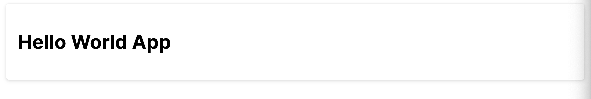

# React + Vite

This template provides a minimal setup to get React working in Vite with HMR and some ESLint rules.

Currently, two official plugins are available:

- [@vitejs/plugin-react](https://github.com/vitejs/vite-plugin-react/blob/main/packages/plugin-react/README.md) uses [Babel](https://babeljs.io/) for Fast Refresh
- [@vitejs/plugin-react-swc](https://github.com/vitejs/vite-plugin-react-swc) uses [SWC](https://swc.rs/) for Fast Refresh

#### Simple Card Prime React

```jsx
<section>
  <div className='surface-card border-round shadow-2 p-4'>
    <h1>Hello World App</h1>
  </div>
</section>
```

#### Center Card

```jsx
<div className='px-4 py-8 md:px-6 lg:px-8 flex gap-2 justify-content-center align-items-center'>
  <div className='surface-card w-6 sm:w-max border-round shadow-2 p-4'>
    <p className='text-center text-6xl font-bold'>Portfolio/Resume</p>
    <p className='text-center font-bold'>
      Lorem ipsum, dolor sit amet consectetur adipisicing elit. Odio, dicta?
    </p>
    <div className='card flex justify-content-center'>
      <Prime.Button label='Click Here' />
    </div>
  </div>
</div>
```

##### Output:


